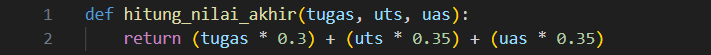

# TugasDictionary

# Langkah - langkah :

# Langkah - langkah Dictionary Nilai Mahasiswa :

## Langkah 1 : Definisi Fungsi hitung_nilai_akhir
   

   Fungsi ini digunakan untuk menghitung nilai akhir berdasarkan formula:
    - Nilai Akhir = (Tugas × 30%) + (UTS × 35%) + (UAS × 35%)
    - Input: Nilai tugas, UTS, dan UAS.
    - Output: Hasil perhitungan nilai akhir.

## Langkah 2 : Definisi Fungsi tampilkan_data

    - Menampilkan semua data mahasiswa dalam bentuk tabel yang rapi.
    - Jika data_mahasiswa kosong, program mencetak pesan bahwa daftar kosong.
    - Format tabel menggunakan metode format string agar kolom rapi:
        - ^ untuk rata tengah.
        - {:<} atau {:>} untuk rata kiri/kanan.