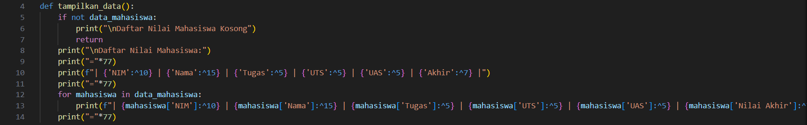

# TugasDictionary

Nama : Nabil Putra Alamsyah
NIM  : 312410376

# Langkah - langkah :

# Langkah - langkah Dictionary Nilai Mahasiswa :

## Langkah 1 : Definisi Fungsi hitung_nilai_akhir
   

   Fungsi ini digunakan untuk menghitung nilai akhir berdasarkan formula:
    - Nilai Akhir = (Tugas × 30%) + (UTS × 35%) + (UAS × 35%)
    - Input: Nilai tugas, UTS, dan UAS.
    - Output: Hasil perhitungan nilai akhir.

## Langkah 2 : Definisi Fungsi tampilkan_data

    - Menampilkan semua data mahasiswa dalam bentuk tabel yang rapi.
    - Jika data_mahasiswa kosong, program mencetak pesan bahwa daftar kosong.
    - Format tabel menggunakan metode format string agar kolom rapi:
        - ^ untuk rata tengah.
        - {:<} atau {:>} untuk rata kiri/kanan.

## Langkah 3 : Inisialisasi Variabel

    - Variabel data_mahasiswa adalah sebuah list untuk menyimpan semua data mahasiswa.
    - Setiap elemen dalam list ini adalah dictionary berisi data:
        {NIM, Nama, Tugas, UTS, UAS, Nilai Akhir}.

## Langkah 4 : Menu Utama

    
    - Menu utama menggunakan loop while agar program berjalan terus sampai pengguna memilih keluar.
    - Menu memberikan pilihan untuk:
        - Menambahkan data (Tambah).
        - Mengubah data (Ubah).
        - Menghapus data (Hapus).
        - Menampilkan data (Lihat).
        - Mencari data (Cari).
        - Keluar dari program (Keluar).

## Langkah 5 : Menambahkan Data

    - Meminta pengguna memasukkan data mahasiswa.
    - Menggunakan fungsi hitung_nilai_akhir untuk menghitung nilai akhir.
    - Menambahkan data mahasiswa sebagai dictionary ke dalam list data_mahasiswa.

## Langkah 6 : Mengubah Data

    - Mencari data mahasiswa berdasarkan NIM.
    - Jika ditemukan, meminta data baru dan memperbarui nilai.
    - Jika tidak ditemukan, mencetak pesan bahwa NIM tersebut tidak ada.

## Langkah 7 : Menghapus Data

    - Mencari data berdasarkan NIM.
    - Jika ditemukan, data dihapus dari list menggunakan remove.
    - Jika tidak ditemukan, mencetak pesan error.

## Langkah 8 : Mencari Data

    - Menampilkan data mahasiswa berdasarkan NIM.
    - Jika tidak ditemukan, mencetak pesan error.

## Langkah 9 : Keluar Program

Keluar dari loop utama, mengakhiri program.

## Output Program :

## FLOWCHART :

